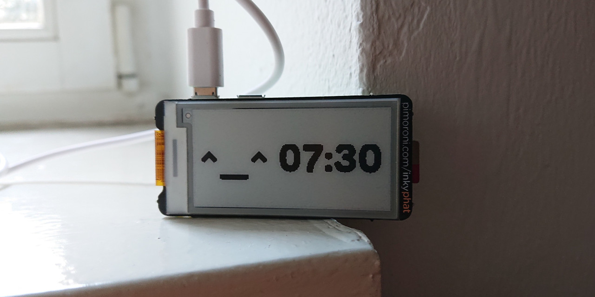
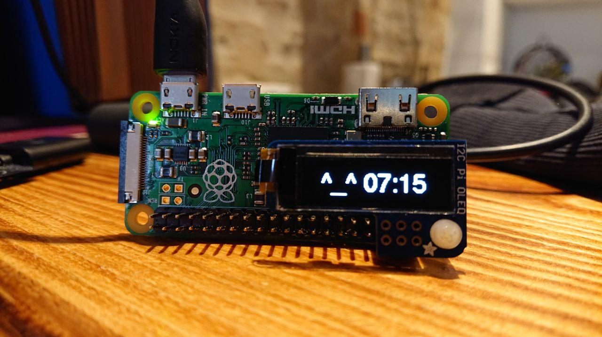

# working time countdown

A working time tracker running on a [Raspberry Pi Zero](https://www.raspberrypi.org/products/raspberry-pi-zero/)/[Zero W](https://www.raspberrypi.org/products/raspberry-pi-zero-w/), powered by NodeJS and/or Python 3.




## How Does It Work

  * once plugged in for the first time, it will start a countdown
  * if unplugged before the countdown is finished, it pauses (will start from that same time next boot)
  * if unplugged after the countdown is finished, it resets itself (will start from scratch next boot/working day)


### When Is It Safe To Unplug ?

If the countdown is finished, i.e. the screen is blinking, it's always safe to unplug the Raspberry Pi Zero/W.

However, to pause it, it's best to wait after next minute update, as any filesystem operation would be done by that time.

Theoretically, you must be quite unlucky to unplug it in a breaking way, but don't worry, the code is super defensive about it so that in the worst case scenario you'll just have a timer starting from scratch.


### How to reset the timer ?

Just let it reach its end, or SSH into your pi and remove the `~/countdown.json` file.

Reboot, and you'll be good to go again.


## How To Install

These instructions are for the [pimoroni b/w Inky pHAT](https://pimoroni.com/inkyphat) and [Waveshare e-Paper](https://www.waveshare.com/wiki/2.13inch_e-Paper_HAT).

Prepare a [BENJA](https://archibold.io/benja/) Raspberry Pi SD card:

```sh
bash <(curl -s https://archibold.io/benja/prepare)
```

Once finished, remove it and put it on your RPi board. Login via `alarm` user and `alarm` password and follow instructions until the board reboot.

At that point, when everything is installed and you have a BENJA prompt, type the following in your Raspberry Pi terminal:

```sh
DISPLAY=pimoroni
# or DISPLAY=waveshare if you use waveshare
# or DISPLAY=oled if you use i2c oled screen

# run the installer
bash <(curl -s https://webreflection.github.io/countdown/${DISPLAY}/install)
```

Reboot the board via `reboot` and see the counter stating.

#### Raspberry Pi Zero without WiFi

If you want to set it up in a Pi Zero W but use after a Pi Zero instead, remember to disable the network.

```sh
netctl list
# read the wlan0 name

sudo netctl disable wlan0-your-SID
sudo systemctl disable dhcpcd
```


## As [BENJA App](https://archibold.io/benja/) with Oled Screen



The provided instructions were for having countdown on [BENJA](https://github.com/WebReflection/archibold.io/tree/gh-pages/benja) and the [i2c Pi Oled screen](https://learn.adafruit.com/adafruit-pioled-128x32-mini-oled-for-raspberry-pi/usage).
