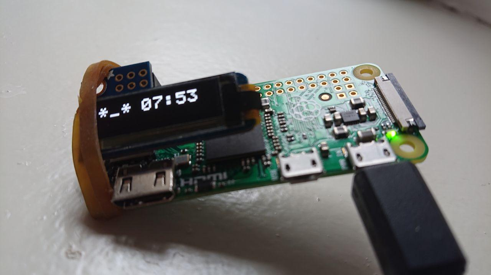

# working time countdown

A working time tracker running on a [Raspberry Pi Zero](https://www.raspberrypi.org/products/raspberry-pi-zero/)/[Zero W](https://www.raspberrypi.org/products/raspberry-pi-zero-w/), powered by NodeJS and/or Python 3.


## How Does It Work

  * once plugged in for the first time, it will start a countdown
  * if unplugged before the countdown is finished, it pauses (will start from that same time next boot)
  * if unplugged after the countdown is finished, it resets itself (will start from scratch next boot/working day)


### When Is It Safe To Unplug ?

If the countdown is finished, i.e. the screen is blinking, it's always safe to unplug the Raspberry Pi Zero/W.

However, to pause it, it's best to wait after next minute update, as any filesystem operation would be done by that time.

Theoretically, you must be quite unlucky to unplug it in a breaking way, but don't worry, the code is super defensive about it so that in the worst case scenario you'll just have a timer starting from scratch.


### How to reset the timer ?

Just let it reach its end, or SSH into your pi and remove the `~/countdown.json` file.

Reboot, and you'll be good to go again.


## How To Install with [pimoroni b/w Inky pHAT](https://pimoroni.com/inkyphat)

Burn the [Raspbian Buster Lite](https://www.raspberrypi.org/downloads/raspbian/) ISO to any SD card.

Boot the Pi Zero and login with user `pi` and pass `raspberry`.

Optionally change the default password via `sudo passwd pi`

Use `sudo raspi-config` to eventually connect to the network (Zero W only) and then [enable auto login](https://www.opentechguides.com/how-to/article/raspberry-pi/134/raspbian-jessie-autologin.html), but also [SSH if you'd like to connect there](https://www.raspberrypi.org/documentation/remote-access/ssh/) remotely.

Update the OS via `sudo apt-get update` and then `sudo apt-get upgrade`, then type the following in console:

```sh
curl https://get.pimoroni.com/inkyphat | bash
```

Follow the instructions, and feel free to type `y` to any question, but it'll take long time to set all things up.

Install latest NodeJS for the Pi Zero/W via:

```sh
wget -O - https://raw.githubusercontent.com/sdesalas/node-pi-zero/master/install-node-v.last.sh | bash
```

Download both js and python scripts and make them executable:

```sh
cd ~/

curl -LO https://webreflection.github.io/countdown/countdown.js
curl -LO https://webreflection.github.io/countdown/countdown.py

chmod a+x countdown.js
chmod a+x countdown.py
```

Add the following content at the end of your `~/.bashrc` file:

```sh
# start countdown on login
if [[ -z $DISPLAY && $XDG_VTNR -eq 1 ]]; then
  # feel free to pass a number of hours to countdown
  # or any string such as '01:30' to count 1 hour and a half
  # if there is a /boot/MESSAGE.txt file, pass it as initial message
  if [ -f /boot/MESSAGE.txt ]; then
    ~/countdown.js 8 "$(cat /boot/MESSAGE.txt)"
  else
    ~/countdown.js 8 # as in 8 hours time tracker countdown
  fi
fi
```

If you create a `/boot/MESSAGE.txt` file with some content, at any time, it will show for few seconds that message every time it starts.

Reboot.


## As [BENJA App](https://archibold.io/benja/) with Oled Screen



These are instructions for having countdown on [BENJA](https://github.com/WebReflection/archibold.io/tree/gh-pages/benja) and the [i2c Pi Oled screen](https://learn.adafruit.com/adafruit-pioled-128x32-mini-oled-for-raspberry-pi/usage).

Prepare a Raspberry Pi Zero/W SD card:

```sh
bash <(curl -s https://archibold.io/benja/prepare)
```

Extract the card, and put it back.

Open a terminal in the the _APP_ disk folder and type the following:

```sh
curl -LO https://webreflection.github.io/countdown/oled/countdown.js
curl -LO https://webreflection.github.io/countdown/oled/package.json
sync
```

Once done, exit from the terminal, unmount the SD card, boot into the Pi Zero/W, complete installation, and wait for the first counter after last reboot.

If you create a `MESSAGE.txt` file in the _APP_ disk/folder, it will show that message every time it starts.

If you want to set it up in a Pi Zero W but use after a Pi Zero instead, remember to disable the network.

```sh
netctl list
# read the wlan0 name

sudo netctl disable wlan0-your-SID
```

### Using a PNG to reverse/center text


If you'd like to see text upside down and centered, type the following in your Raspberry Pi terminal, once BENJA is installed and booted:

```sh
sudo pacman -S --needed graphicsmagick ghostscript xorg-fonts-type1
curl -LO https://archibold.io/benja/fonts/n019003l.pfb
sudo mv n019003l.pfb /usr/share/fonts/Type1/

cd ~/
npm i --save gm png-to-lcd

cd ~/app
curl -LO https://webreflection.github.io/countdown/oled/countdown-image.js
curl -LO https://webreflection.github.io/countdown/oled/package.json
mv countdown-image.js countdown.js
sync
```

Reboot the Raspberry Pi Zero/W and put it upside down.

## As [BENJA App](https://archibold.io/benja/) with [Waveshare e-Paper](https://www.waveshare.com/wiki/2.13inch_e-Paper_HAT)

Be sure `dtparam=spi=on` is present in `/boot/config.txt`, then type the following:

```sh
cd ~/
sudo pacman -S --needed --noconfirm python-pip python-numpy python-pillow wiringpi inotify-tools
sudo pip install RPi.GPIO spidev font-fredoka-one inotify_simple
git clone https://github.com/waveshare/e-Paper
cd e-Paper/RaspberryPi\&JetsonNano/python
sudo python setup.py build
sudo python setup.py install
cd ~/app
echo 'COUNTDOWN'>MESSAGE.txt
curl -LO https://webreflection.github.io/countdown/waveshare/countdown.js
curl -LO https://webreflection.github.io/countdown/waveshare/countdown.py
curl -LO https://webreflection.github.io/countdown/waveshare/package.json
sudo rm -rf ~/e-Paper
sync
```

Rebooting your Pi should start the countdown.
